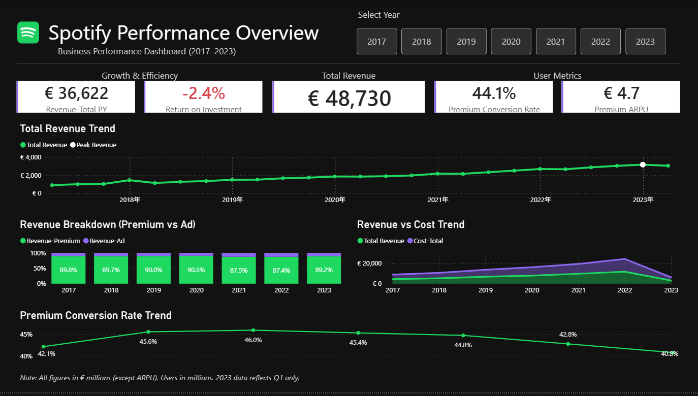
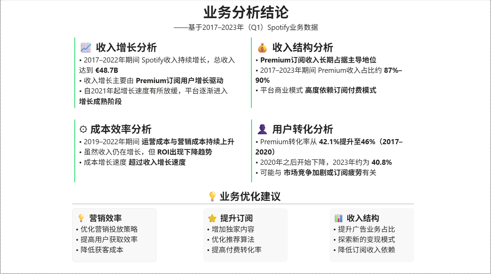
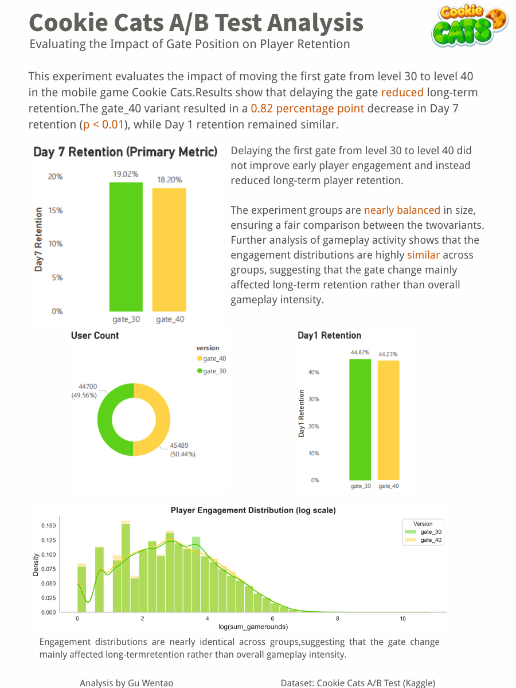
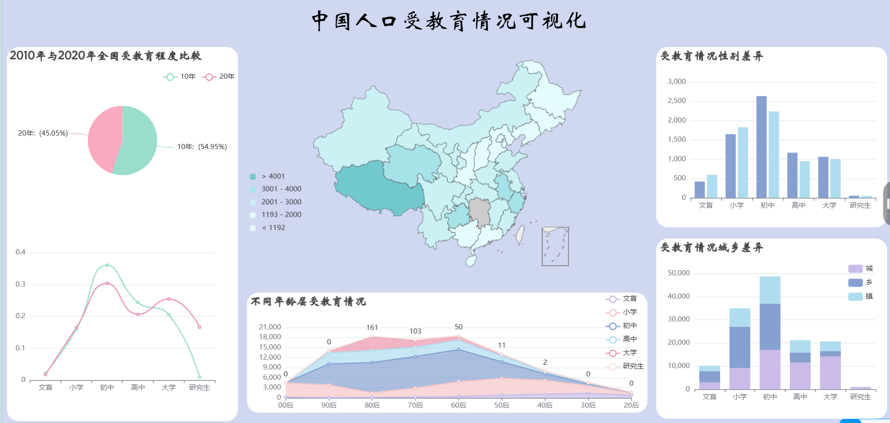

# 数据项目作品集（Data Projects Portfolio）

作者：顾文涛  

本仓库用于展示个人完成的数据分析与数据可视化相关项目，主要通过 Power BI、Python、Excel、JavaScript 等工具，对数据进行整理、分析与可视化展示，从数据中提取有价值的信息并进行直观呈现。

---

# 项目列表

## 1. Spotify 商业数据分析

**工具：** Power BI / Excel / DAX  

**项目简介：**  
基于 Spotify 2017–2023 年业务数据，对平台收入增长趋势、收入结构以及用户相关指标进行分析，并构建可视化分析仪表板。

**项目内容：**
- 分析平台收入增长趋势  
- 对 Premium 订阅收入与广告收入结构进行拆解  
- 构建可视化 Dashboard 展示关键业务指标  

### 可视化展示

**Dashboard Overview**

**Business Insights**

---

## 2. Cookie Cats A/B Test 实验分析

**工具：** Python / Jupyter / Pandas / Matplotlib / Canva  

**项目简介：**  
通过 A/B Test 方法分析游戏设计变化对玩家留存率的影响，并对不同版本进行数据对比分析。

**项目内容：**
- 分析 Day1 与 Day7 留存率  
- 对 gate_30 与 gate_40 两个版本进行实验对比  
- 使用 Python 进行数据处理与可视化展示  

### 分析结果海报

---

## 3. 中国人口受教育情况数据可视化

**工具：** JavaScript / HTML / CSS / Python / Apache Charts  

**项目简介：**  
基于人口普查相关数据，对中国人口受教育情况进行统计与可视化展示，从多个维度分析人口教育结构。

**分析维度：**
- 年龄结构与受教育水平  
- 城乡教育差异  
- 性别教育差异  
- 不同学历层级分布  

### 可视化结果

---

# 技术工具

Power BI ｜ Python ｜ Jupyter  ｜  Excel ｜ SQL ｜ JavaScript ｜ Github ｜ Canva  

---

# 项目说明

本仓库主要用于记录与展示个人在数据分析与数据可视化方向的学习实践，通过不同项目探索如何将原始数据转化为有价值的信息，并通过图表或可视化方式进行展示。
